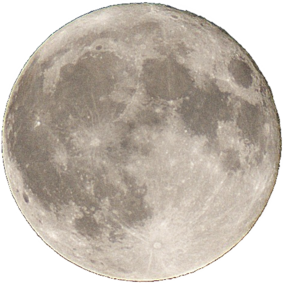

**Graphics** refers not to *how* something looks but how the image is produced from a technical standpoint. You may be familiar with some graphics concepts already. For example, you may have heard of image file formats such as .png, .gif, or .jpeg. We would use these files for **2D** graphics. There are also formats such as .glb, .stl, and .fbx. These are **3D** model formats. It is important to note that an image appearing "retro" or "pixelated" is an **Aesthetic** choice, not purely a **Graphical** choice. Your **Aesthetic** choices might influence the types of **Graphics** you use!

For **2D** images there are two categories for how the images are produced: *Raster* and *Vector* graphics. *Raster* images are made up of individual blocks of color called **pixels**. The amount of **pixels** contained in the image is the image's **resolution**, usually expressed in the width and height of the image in **pixels** ie. 1920x1080, 720x720, 38x38, etc. Low **resolution** images will look blurry when zoomed in on or scaled up, as the **pixels** are increasing in size.

In contrast, *Vector* images tell the computer points in space to draw "curves" between. Think of *Vector* graphics formats as instructions for how to draw an image instead of the image itself. This allows for scaling images up and down without blurriness. 

Some image formats also allow for **transparency**. These images can have **transparent** backgrounds, leaving only the image we want to see instead of including a black or white background. All *vector* graphics formats can have **transparency** but only certain *raster* formats allow for **transparency**.

| Raster Format | Vector Format |
|  :---------:  | :-----------: |
|.jpeg          | .svg          |
|.png*          | .gif          |
|.gif*          |               |
|.webp*         |               |

*has **transparency**

Topic - Graphics
Lesson - Graphics Identification
Goals
* Identify a game's genre
* Identify the similar characteristics of games within the same genre
* Differentiate genre and aesthetics
Outcomes
* Description of the gameplay characeristics of multiple games
* Description of what separates the games in the genre
Content and Standards alignment
Topic
Topic