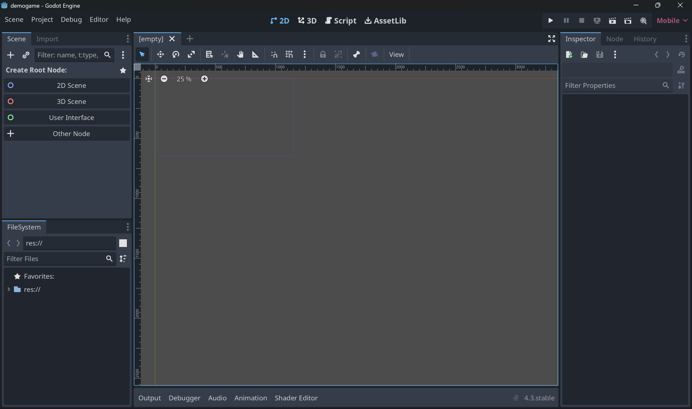
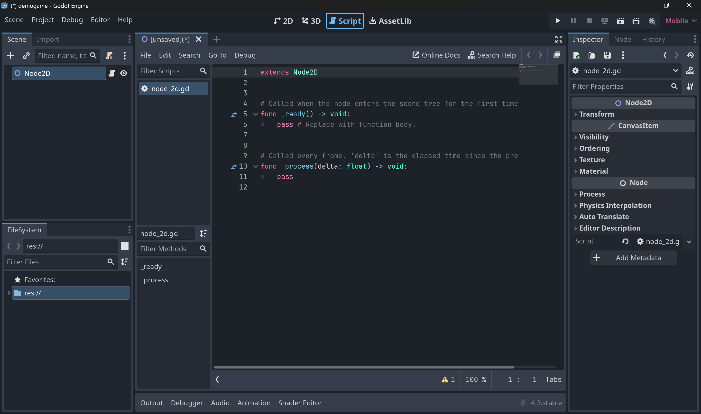

#### 1. The 2D View

**The 2D View**
**Purpose**: This view is where you create and edit 2D game scenes.
**Use Case**: Perfect for making platformers, top-down games, or any other 2D game.
**Key Features**: You can add sprites, shapes, and collision objects. It has a grid for precise placement and snapping.

#### 2. The 3D View

**The 3D View**
**Purpose**: This view allows you to work on 3D game scenes.
**Use Case**: Ideal for 3D games where you can create complex environments and models.
**Key Features**: It provides tools for adding 3D meshes, lights, cameras, and physics bodies. You can navigate and manipulate objects in a 3D space.

#### 3. The Script View

**The Script View**
**Purpose**: This view is where you write and edit code to bring your game to life.
**Use Case**: Essential for adding logic, behaviors, and interactivity to your game
**Key Features**: It includes a powerful code editor with syntax highlighting, auto-completion, and debugging tools. Here, you can write scripts in GDScript, VisualScript, or even C#.

#### 4. Asset Management

**The Asset Manager**
**Purpose**: This view helps you manage all your game assets.
**Use Case**: Useful for organizing resources like images, sounds, scripts, and scenes.
**Key Features**: It shows a hierarchical view of your project’s files, making it easy to find and manage assets. You can drag and drop assets into your scenes directly from here.

#### Summary
**2D View:** Focuses on creating 2D games.

**3D View:** Focuses on creating 3D games.

**Script View:** For writing code to control your game.

**Asset Manager:** For managing your game’s resources.