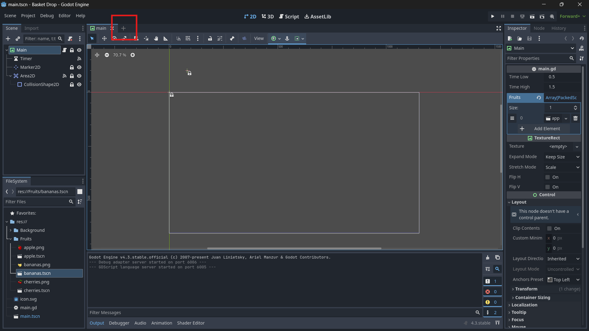

We'll start by making our player, a basket that can move left and right at the bottom of the screen that can catch the falling fruit.

We'll start by making a new scene for our player by clicking the "+" on the scenes dock:

Once we make the scene we'll need to select the proper root node. Let's take a second to think about the needs of this scene. The player will be controlling this scene directly through inputs. Think about the nodes that move, and think about which of those nodes allows for direct control. What node should be the root node for the player scene?

>Click for Answer

CharacterBody2D

