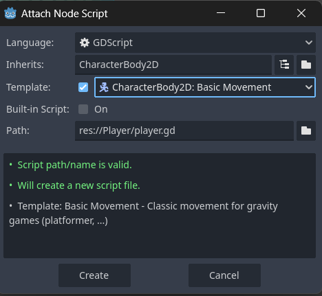
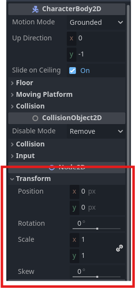
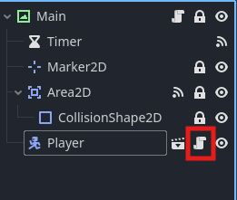

We'll start by making our player, a basket that can move left and right at the bottom of the screen that can catch the falling fruit.

We'll start by making a new scene for our player by clicking the "+" on the scenes dock:


Once we make the scene we'll need to select the proper root node. Let's take a second to think about the needs of this scene. The player will be controlling this scene directly through inputs. Think about the nodes that move, and think about which of those nodes allows for direct control. What node should be the root node for the player scene?

<details style="background-color:rgba(92, 184, 92, 0.25);">
<summary style = "cursor:pointer">Reveal Answer</summary>

- CharacterBody2D

</details>


Once you've added your node make sure to rename it to "Player" before doing anything else. Then save your scene.

Let's do some file management as well, go ahead and make a new folder in your filesystem (you can do this by right clicking "res://" and selecting Create New->Folder) and name it "Player". This is where we'll store all of the assets and files we make associated with this scene. Go ahead and drag and drop your player scene into this new folder. Your filesystem should look like this currently:


Before we do anything else we'll need to go online to find some assets. We'll need an image to represent our player. This could be anything you'd like, remember this is an **Aesthetic** choice. Keep in mind that the player is going to catch things falling from the sky. You can use Google Image Search or [Open Game Art](https://opengameart.org) to find a suitable image. In our example we'll use a basket.


Once you find your image, go ahead and download it. Make sure that it has a **transparent** background. If it is a .png or .jpeg file you can use a tool like [remove.bg](https://www.remove.bg/) to make the background transparent. Once you've downloaded your **transparent** image, we'll bring it into Godot by dragging it from our computer's file system into the Godot editor. Make sure to move it into the "Player" folder once you've imported the file.


<p align="center">


</p>


Next let's add some more nodes to our scene. We'll need to add two nodes, one to display an image and another to define the shape of our player. What would these nodes be? Be careful when adding these new nodes, they should both be direct *children* of the root node.

<details style="background-color:rgba(92, 184, 92, 0.25);">
<summary style = "cursor:pointer">Reveal Answer</summary>

- Sprite2D (Image)

- CollisionShape2D (Shape)


</details>


Depending on the size of your image you may need to resize it. You can do this by clicking the **Sprite2D** and changing the *Scale* property in the **Inspector**. We'll need to modify the shape of our CollisionShape2D to fit over our image properly. Let's click on the "CollisionShape2D" in the scene tree and change its "Shape" property in the **Inspector**. Let's go ahead and select a *RectangleShape2D* and align it with our image.


<p align="center">
<video width="640" height="360" autoplay muted loop>
    <source src="../../media/BasketCatchImages/Making-the-Player/collision-shape-vid-1.mp4" type="video/mp4">
</video>
</p>


In order for us to move our player we'll need to add a script. Go ahead and click on the player and press the *attach script* button. We'll select the "CharacterBody2D: Basic Movement" template as a starting place. If we've already named our **Root Node** the default script name will be the name of that node! Make sure once you've made the script that it is in your "Player" folder. We'll need to modify this script to make our player behave how we expect it to. 




After you've saved everything let's try running the current scene to see what happens. Does the player act as you expect?


<details style="background-color:rgba(92, 184, 92, 0.25);">
<summary style = "cursor:pointer">Reveal Answer</summary>

- The player should fall straight down. However, you should be able to move the player to the left and right slightly.

</details>


Let's close our game and go back to the **Script** view. In the **Script** view we'll see the default movement code. We'll need to modify this code so that our player will only be able to move left and right, not up and down. Below is the code:

```
extends CharacterBody2D


const SPEED = 300.0
const JUMP_VELOCITY = -400.0


func _physics_process(delta: float) -> void:
	# Add the gravity.
	if not is_on_floor():
		velocity += get_gravity() * delta

	# Handle jump.
	if Input.is_action_just_pressed("ui_accept") and is_on_floor():
		velocity.y = JUMP_VELOCITY

	# Get the input direction and handle the movement/deceleration.
	# As good practice, you should replace UI actions with custom gameplay actions.
	var direction := Input.get_axis("ui_left", "ui_right")
	if direction:
		velocity.x = direction * SPEED
	else:
		velocity.x = move_toward(velocity.x, 0, SPEED)

	move_and_slide()


```


First, let's get rid of any references to moving on the **y-axis**. The **property** *velocity* tells the CharacterBody2D how many pixels to move per second, we can see that *velocity* is referenced throughout this script, sometimes followed by a **.y** or **.x**. These lines only modify the *velocity* on that axis. We also see a line that references *gravity*, this line is applying a constant downward force on our player. Let's go ahead and remove all of the lines that include *velocity.y* or *gravity*. (Hint: Make sure to remove any *if* statements that are empty after deleting code.)


<details style="background-color:rgba(92, 184, 92, 0.25);">
<summary style = "cursor:pointer">Reveal Answer</summary>

```
extends CharacterBody2D


const SPEED = 300.0
const JUMP_VELOCITY = -400.0


func _physics_process(delta: float) -> void:

	# Get the input direction and handle the movement/deceleration.
	# As good practice, you should replace UI actions with custom gameplay actions.
	var direction := Input.get_axis("ui_left", "ui_right")
	if direction:
		velocity.x = direction * SPEED
	else:
		velocity.x = move_toward(velocity.x, 0, SPEED)

	move_and_slide()


```

</details>

Let's go ahead and run our current scene again and try to move the player using the arrow keys. You should be able to move left and right but not up and down. Let's also take a second to make sure that all of our nodes are at origin. Go ahead and click on each node, starting with the root node, and make sure that their **x** and **y** **Position** in the **Inspector** under the **Transform** are both set to **0**.




Now let's add our player to the *Main* scene. Switch to the *Main* scene by either clicking on the "Main" tab in the scene tabs or by double clicking the "main.tscn" file in the *FileSystem* dock. Then drag your player into your *Main* scene, placing them somewhere near the bottom of the screen. Go ahead and run the *Main* scene and attempt to catch the falling apple. What happens? Why does this happen?


<details style="background-color:rgba(92, 184, 92, 0.25);">
<summary style = "cursor:pointer">Reveal Answer</summary>

- Attempting to catch a fruit causes the player to be forced downward. This is because: 
- The CollisionShape of the basket covers the entirety of the basket instead of just the edges. 
- While we took out the code referencing movement on the **y-axis** other **PhysicsBodies** can still *push* our player along the **y-axis**.

</details>


We'll need to make a few edits to our script and player scene to address these issues. Let's start with our script. Go ahead and click the *script* icon attached to our *Player* node in the scene tree:



Then we'll need to add some code that *locks* our player's **y-axis** position. For this we'll need to create a **variable** to store the player's *initial* y position. We'll also need to add our **_ready()** function to this script.


```
extends CharacterBody2D


const SPEED = 300.0
const JUMP_VELOCITY = -400.0

var start_pos = 0

func _ready() -> void:
	
	pass

func _physics_process(delta: float) -> void:
	
	# Get the input direction and handle the movement/deceleration.
	# As good practice, you should replace UI actions with custom gameplay actions.
	var direction := Input.get_axis("ui_left", "ui_right")
	if direction:
		velocity.x = direction * SPEED
	else:
		velocity.x = move_toward(velocity.x, 0, SPEED)

	move_and_slide()
```

Next we'll need to store the starting **y** position value in our variable *start_pos*. We can access just the **y** value of the **position** property in the same way that the **y** value of the **velocity** property was accessed earlier by putting a **.y** after **position**. (**position.y**) Which function should this be placed in? Remember, we only want to store this value once when the game starts.

<details style="background-color:rgba(92, 184, 92, 0.25);">
<summary style = "cursor:pointer">Reveal Answer</summary>

- We should place our code in the **_ready()** function. If we put it in the **_physics_process()** function it would be updated every frame.
- We'll need to edit our **_ready()** function to look like this:

```
func _ready() -> void:
	
    start_pos = position.y  
    
	pass
	
```


</details>


We then need to add code to continuously set our *Player*'s **y** postion to the value stored in our *start_pos* variable. Which function should this be placed in? What would the code look like?

<details style="background-color:rgba(92, 184, 92, 0.25);">
<summary style = "cursor:pointer">Reveal Answer</summary>

- We should place our code in the **_physics_process()** function. If we put it in the **_ready()** function it would only happen once when our game started.
- We'll need to edit our **_physics_process()** function to look like this:

```
func _physics_process(delta: float) -> void:
	
     position.y = start_pos

    # Get the input direction and handle the movement/deceleration.
	# As good practice, you should replace UI actions with custom gameplay actions.
	var direction := Input.get_axis("ui_left", "ui_right")
	if direction:
		velocity.x = direction * SPEED
	else:
		velocity.x = move_toward(velocity.x, 0, SPEED)

	move_and_slide()
```
- Notice that we've essentially done the reverse process. First storing the position value in a variable in the **_ready** function before changing the position value using the variable in the **_physics_process()** function.
</details>


If we our *Main* scene now we'll still notice an issue. While our *Player* now returns to its starting **y** position (most of the time), it now flings apples through the air instead of letting them pass through the middle!


<p align="center">
<video width="640" height="360" autoplay muted loop>
    <source src="../../media/BasketCatchImages/Making-the-Player/apple-fling.mp4" type="video/mp4">
</video>
</p>


We'll need to make an edit to the collision of our *Player*, so lets switch back to the *Player* scene by either selecting the "Player" tab or double clicking the "player.tscn" file in the FileSystem. While we've previously only used a single **CollisionShape2D** to define the shape of a **PhysicsBody** we can actually use multiple CollisionShapes if our **PhysicsBody** has gaps in its shape/image. Let's make it so that the only parts of our player that have *collision* are the sides. We want the falling objects to pass through the middle of our *Player* but to bounce off its side. We'll start by editing the current **CollisionShape2D** to cover just the left edge of the image. Then we can duplicate the **CollisionShape2D** by right clicking it in the inspector and selecting "Duplicate" or by using the *duplicate* hotkey **ctrl+d**. We'll then move the duplicated shape to the opposite side of the basket. (Remember: Any edits we make to a scene will also happen to any *instances* of that scene elsewhere in our project.)


<p align="center">
<video width="640" height="360" autoplay muted loop>
    <source src="../../media/BasketCatchImages/Making-the-Player/duplicate-shape.mp4" type="video/mp4">
</video>
</p>

Now our apple should pass right through! Go ahead and run your *Main* scene to test and make sure that apples can fall *through* your *Player* as well as *collide* with its sides.

