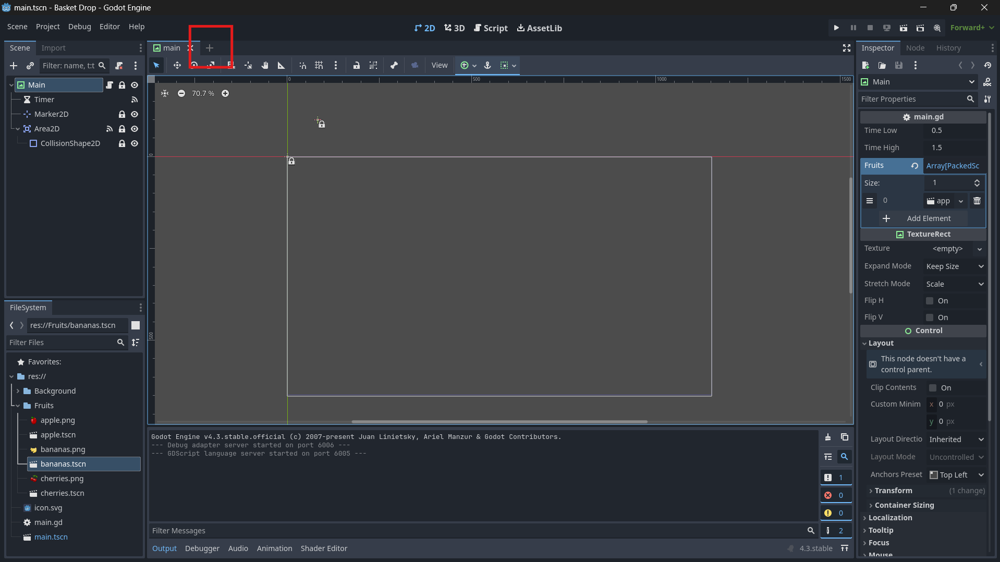
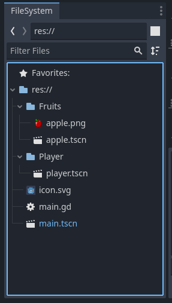
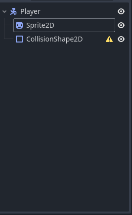

We'll start by making our player, a basket that can move left and right at the bottom of the screen that can catch the falling fruit.

We'll start by making a new scene for our player by clicking the "+" on the scenes dock:

Once we make the scene we'll need to select the proper root node. Let's take a second to think about the needs of this scene. The player will be controlling this scene directly through inputs. Think about the nodes that move, and think about which of those nodes allows for direct control. What node should be the root node for the player scene?

Reveal Answer

- CharacterBody2D

Once you've added your node make sure to rename it to "Player" before doing anything else. Then save your scene.

Let's do some file management as well, go ahead and make a new folder in your filesystem (you can do this by right clicking "res://" and selecting Create New->Folder) and name it "Player". This is where we'll store all of the assets and files we make associated with this scene. Go ahead and drag and drop your player scene into this new folder. Your filesystem should look like this currently:

Before we do anything else we'll need to go online to find some assets. We'll need an image to represent our player. This could be anything you'd like, remember this is an **Aesthetic** choice. Keep in mind that the player is going to catch things falling from the sky. You can use Google Image Search or [Open Game Art](https://opengameart.org) to find a suitable image. In our example we'll use a basket.

Once you find your image, go ahead and download it. Make sure that it has a **transparent** background. If it is a .png or .jpeg file you can use a tool like [remove.bg](https://www.remove.bg/) to make the background transparent. Once you've downloaded your **transparent** image, we'll bring it into Godot by dragging it from our computer's file system into the Godot editor. Make sure to move it into the "Player" folder once you've imported the file.

Next let's add some more nodes to our scene. We'll need to add two nodes, one to display an image and another to define the shape of our player. What would these nodes be? Be careful when adding these new nodes, they should both be direct *children* of the root node.

Reveal Answer

- Sprite2D (Image)

- CollisionShape2D (Shape)

We'll need to 
