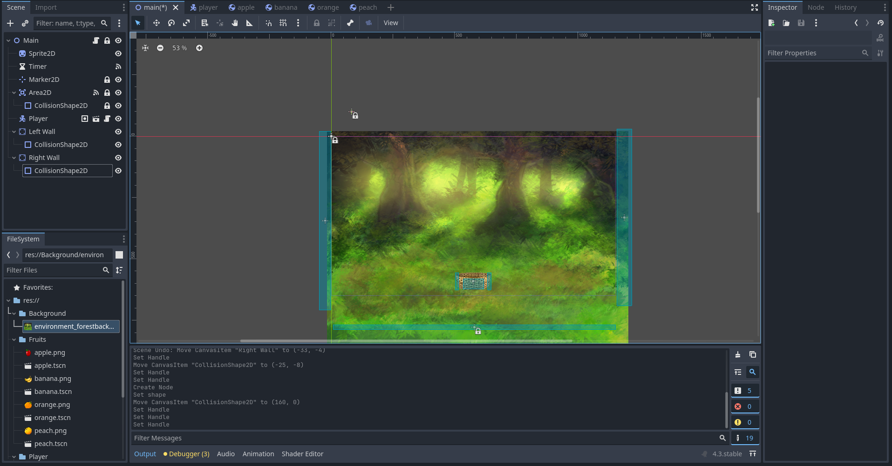

By this point, you may have noticed that there are some inconsistencies with the behavior of our *Player*. Your *Player* may be getting removed from the game when an object hits its side. This is due to the *Player*'s hitbox being forced into the **Area2D** for a frame. Our code currently deletes any **PhysicsBody** that enters our **Area2D**, this includes the *Player*. We can stop this from happening by using **Groups** to categorize our nodes into nodes we want to delete and nodes we do not want to delete. We'll use two different groups to do this: One for the *Player* and one for the falling *Objects*.

Let's start with the *Player*. We'll go over to the *Player* scene, select the *root* node, and open the **Node** tab in the **Inspector** dock. At the top of the **Node** tab we see the option to view the node's **Groups**. If we click on *Groups* we can add the node to a group by pressing the "+" button at the top of the tab. When we press this a dialogue box will open where we can name the group, let's name this one "player" (careful with spelling here). We'll also select the "Global" option to make this a **Global** group.


<p align="center">
<video width="640" height="360" autoplay muted loop controls>
    <source src="../../../../media/BasketCatchImages/MakeGlobal/CreateGroup.mp4" type="video/mp4">
</video>
</p>

Go ahead and open the *Apple* scene by double clicking the "apple.tscn" file in the FileSystem. Then follow the same procedure to add the apple to a new group called "collectible". Make sure this is also a **Global** group.


## Using Groups in Code

Now that we've had some practice adding nodes to **Groups** let's use them in code. We'll start by modifying the **Signal Function** in our *Player* script. We'll use a **conditional** statement to check if the *body* entering the **Area2D** is in the "collectible" group, and then only if it is in that group will we remove the *body* and increase the *score*. We can check if a node is in a certain **Group** by calling the *is_in_group()* method on an object. This method takes an argument of the name of a **Group** as a **string**. This returns **true** if the object is in the group and **false** if it is not. (Hint: You should be able to do this by creating a **conditional** statement and placing everything currently in the **Signal Function** inside that conditional)


<details style="background-color:rgba(92, 184, 92, 0.25);">
<summary style = "cursor:pointer">Reveal Answer</summary>

- Remember, this code is found in the *Player* script

```
func _on_area_2d_body_entered(body: Node2D) -> void:
	
	if body.is_in_group("collectible"):
		body.queue_free()
		Global.score += 1
		print(Global.score)
	
	pass # Replace with function body.
```

</details>

If you have done this correctly, our game will now only allow the collectibles to be deleted and increase the score not the *Player*. Let's add another condition to our code, one that only allows us to increase the score while our *game state* (stored in *Global.game_state*) is "playing". We should still be able to delete collectibles even if the *game state* is <ins>not</ins> "playing". There are multiple ways to do this! (Hint: You may need to "nest" an if statement inside the one we've already made.)


<details style="background-color:rgba(92, 184, 92, 0.25);">
<summary style = "cursor:pointer">Reveal Answer</summary>

- Remember, this code is found in the *Player* script

```
func _on_area_2d_body_entered(body: Node2D) -> void:
	
	if body.is_in_group("collectible"):
		body.queue_free()
        if Global.game_state == "playing"
		    Global.score += 1
		    print(Global.score)
	
	pass # Replace with function body.
```

</details>


## Now it's your turn!

Let's make some of our own collectibles now! Using the "apple" scene as a reference, create 3 new scenes that will be objects that fall from the top of the screen. These can look any way that you would like, this is an **Aesthetic** choice. For example, if your *Player* image was a fishing net, you may be collecting different fish that fall from the sky. Be creative with this! Make sure to add each new collectible to the "collectibles" group. Also make sure that you are using the right kind of **PhysicsBody**, your scene trees are structured properly, and that all of your collectibles are roughly the same size.

Once you've made all of your collectibles, you can add them to the spawner by following this video. You can also remove the "Apple" from the list or replace the image in the Apple scene if you would like.

//Add Video Showing how to Add New Scenes to Spawner


<p align="center">
<video width="640" height="360" autoplay muted loop controls>
    <source src="../../../../media/BasketCatchImages/MakeGlobal/AddNewCollectibles.mp4" type="video/mp4">
</video>
</p>


We'll also want to make our game look a bit nicer, go ahead and add a background image to your game. (Hint: You'll want to move the image to be the *first* child in the scene so it appears *below* any other images.)

Make sure to make a new folder in your FileSystem for your background image.


<details style="background-color:rgba(92, 184, 92, 0.25);">
<summary style = "cursor:pointer">Reveal Answer</summary>

- Remember: We can use a **Sprite2D** to add an image to our scene. 

- The scene tree should look similar to this:


</details>

Finally, our *Player* can currently exit the screen. We would like our player to stay inside the screen. How might we accomplish this? (Hint: There's more than one way to do this! You can do this using only nodes or only code. Think about which **PhysicsBody** node would be appropriate for a wall...) 


<details style="background-color:rgba(92, 184, 92, 0.25);">
<summary style = "cursor:pointer">Reveal Answer</summary>

- Using Nodes: We can use **StaticBody2D**s to create walls that stop the player from exiting the screen. 



- Using Code: We can modify the *Player* script to only allow the user to move left when the *Player*'s **x** position is *greater than or equal to* 0 and only move to the right when *less than or equal to* the width of the view (1152).

Original Code
```

func _physics_process(delta: float) -> void:
	
	position.y = start_pos
	# Get the input direction and handle the movement/deceleration.
	# As good practice, you should replace UI actions with custom gameplay actions.
	var direction := Input.get_axis("ui_left", "ui_right")
	
	if direction:
		velocity.x = direction * SPEED
	else:
		velocity.x = move_toward(velocity.x, 0, SPEED)

	move_and_slide()

```


Modified Code
```
func _physics_process(delta: float) -> void:
	
	position.y = start_pos
	# Get the input direction and handle the movement/deceleration.
	# As good practice, you should replace UI actions with custom gameplay actions.
	var direction := Input.get_axis("ui_left", "ui_right")
	
	if (direction < 0 and position.x >= 0) or (direction > 0 and position.x <= 1152):
		velocity.x = direction * SPEED
	else:
		velocity.x = move_toward(velocity.x, 0, SPEED)

	move_and_slide()

```


</details>

If you have done everything correctly, your game should resemble this:


<p align="center">
<video width="640" height="360" autoplay muted loop controls>
    <source src="../../../../media/BasketCatchImages/MakeGlobal/GlobalEnd.mp4" type="video/mp4">
</video>
</p>